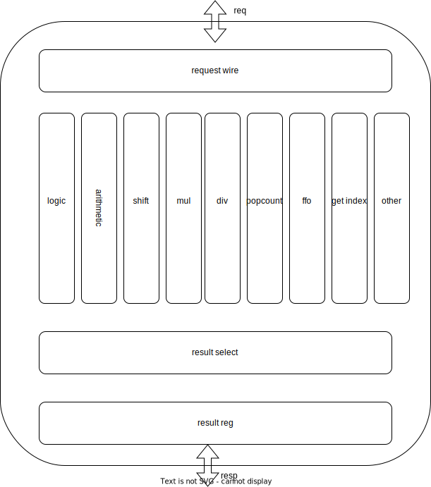

## lane

在这个设计中, lane仅仅只作为执行单元

#### 1.指令分类

##### 1.1逻辑运算

包括arithmetic里面的逻辑计算, mask指令里面的逻辑计算

* and 
* or 
* xor
* seq -> xor
* sne -> nxor?

mask

* nand

* andn

* xor

* xnor

* nor

* orn

  

##### 1.2算数运算

* add
* sub
* (m)adc
* (m)sbc
* slt(u)
* sle(u)
* sgt(u)
* sge(u)
* max(u)
* min(u)

定点

* vsadd/sub: 需要处理溢出
* vaadd/sub: 去掉低位舍入

##### 1.3 移位

* sll
* s(n)rl
* s(n)ra

定点

* ssrl(只右移,需要处理舍入)
* ssra

##### 1.4多周期(m/d/ma)

*  div(u)
* rem(u)
* wmul
* wmulu
* wmulsu
*  乘加 vmacc vnmsac vmadd vnmsub (有widen类的)

##### 1.5 其他指令

* Integer Extension:需要纠结过不过lane
* vmerge: 

reduce: reduce 直接过运算单元, reduce 的控制外面做就好了

* sum
* max
* min
* and
* or
* xor
* vwredsumu (wide的reduce, 初始值和vd都是 2 * sew)

mask

* pop count
* find first one: 4种变体
* vid: 获取index的逻辑

permutation

* gather: 需要与maxvlen 比较的逻辑, 合并

#### 2.结构

* 如图, 进lane把所有数据广播给所有的执行单元, 然后根据控制逻辑决定是否需要计算(执行单元可能需要在不是自己的请求的时候把输入拉0)
* 然后根据控制从多个结果中选一个出来写到寄存器里面, 然后做一些通用的处理(widen, extend...)
* 如果不是单周期的请求result的使能由计算单元给出.

#### 3.计算单元
##### 3.1 logic

位运算计划用单bit查表的方式计算,逻辑运算有8种 and nand andn or nor orn xor xnor, 直接用这三位和两bit的输入算真值表.

逻辑运算的编码下不纠结, 先随便编. 真值表代码里算去. 

##### 3.2 arithmetic

这里面只有一个加法器, 因为需要兼容adc ma, 所以是一个三输入的加, 这样减法就是取反加1(减两是取反加2), 额外续要1bit作为carry.

输入简单,但是输出的选择有很多:

* 正常的结果
* madc msbc < 的取符号位
* \> 的符号位取反
* max 选出的大值
* min选出的小值

只有这一个单元有第三个操作数, 这个操作数的处理分类:

* adc: mask, 此时 sub1 == 0, maskOP2 == 1
* sbc: sub1 == 1 maskOP2 == 1, 这时候如果 mask == 0, 那么第三个操作数是1, 如果mask == 1, 那么第三个操作数是0.
* ma: 来自乘加的三个操作数, 乘减需要处理, 暂时先用3连加吧. 

##### 3.2 shift
正常的移位, 注意不同sew的移动有效位不同, sign决定填充的是0还是符号.

##### 3.3 mul
直接用华莱士树乘法, 得到最终的c&s, 最后过一次加法器, 有乘加就把加的值作为第三个输入.

##### 3.4 div

正常的除法器, 需要纠结的是init是否在里面做.

##### 3.5 popcount

算一串数里面有几个1, 先用chisel自带的, 后面再纠结咋优化.

##### 3.6 ffo

find first one, 也用通用的, 根据控制信号返回不同的结果.

##### 3.7 get index

根据lane自己的标号和控制里面的组号拼接成整体的index.

#### 4. 外壳

##### 4.1 io

| 取名            | 方向 | 位宽       | 描述                                                         |
| --------------- | ---- | ---------- | ------------------------------------------------------------ |
| index           | I    | log2(lane) | lane的序号                                                   |
| uop             | I    | 4          | decode解出来的, 在lane里面会二次解码                         |
| w               | I    | 1          | 是不是wide类型的操作                                         |
| n               | I    | 1          | 是不是narrow类型的操作                                       |
| sew             | I    | 2          | 操作数的宽度(8, 16, 32, 64)                                  |
| src             | I    | 3 * ELEN   | 三个源操作数                                                 |
| groupIndex      | I    | 5          | 一个指令会被分成多组执行, 这是组的序号                       |
| rm              | I    | 2          | rounding mode                                                |
| mask -> maskOP2 | I    | 1          | 第三个操作数是否作为mask格式操作的mask (有点让自己误解,换个名字) |
| maskDestination | I    | 1          | 目标寄存器是否作为mask格式的                                 |

##### 4.2 uop 编码

| 操作     | 单元编码 | 操作编码(基) | 说明                                                         |
| -------- | -------- | ------------ | ------------------------------------------------------------ |
| and      | 0        | 0            |                                                              |
| nand     |          | 1            |                                                              |
| andn     |          | 2            |                                                              |
| or       |          | 3            |                                                              |
| nor      |          | 4            |                                                              |
| orn      |          | 5            | b                                                            |
| xor      |          | 6            |                                                              |
| xnor     |          | 7            | +8                                                           |
| add      | 1        | 0            | (+-需要添加Averaging的四种编码)                              |
| sub      |          | 1            | src2取反, src3为1                                            |
| adc      |          | 2            | src3是carry                                                  |
| madc     |          | 3            | 同上,结果要c                                                 |
| sbc      |          | 4            | src2取反, src根据作为c的mask是否是1来决定是否+1              |
| msbc     |          | 5            | 同上,结果要c                                                 |
| 比较类   |          | 6            | slt(u) sle(u) sgt(u) sge(u)                                  |
| max/min  |          | 7            | max(u) min(u) +18                                            |
| sll      | 2        | 0            | 左移                                                         |
| srl      |          | 1            | 逻辑右移                                                     |
| sra      |          | 2            | 算数右移                                                     |
| ssrl     |          | 3            | 同上只是由于定点需要处理舍入                                 |
| ssra     |          | 4            | +4                                                           |
| mul      | 3        | 0            | l h hu hsu四种                                               |
| wmul     |          | 4            | l u su 三种                                                  |
| ma       |          | 7            | 乘加对于这边来说只有两种, 加积或减积, 操作数的位置在decode的时候调整+9 |
| div      | 4        | 0            | d/r * s 4种 +4                                               |
| popcount | 5        | 0            | 只有一个, 是否使用mask额外给控制                             |
| ffo      | 6        | 0            | 有四种, 同样有mask控制                                       |
| getIndex | 7        | 0            | 也只有一个                                                   |

暂时用6位编码, 用3 + 3 的方式没有那么必要,所以直接以这个顺序算解码就好了.
